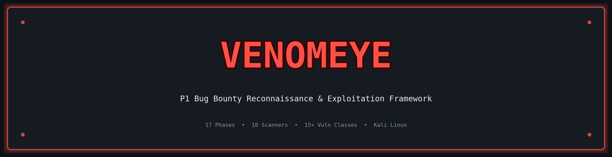
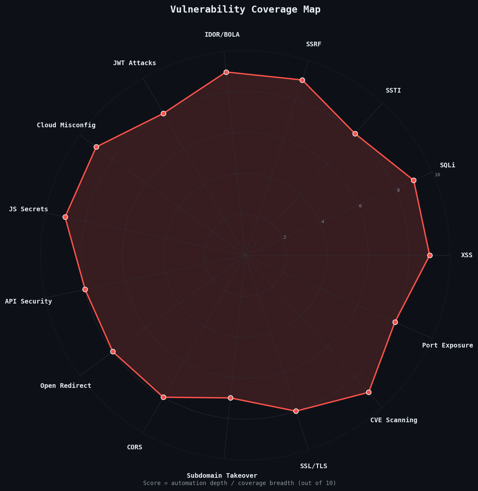
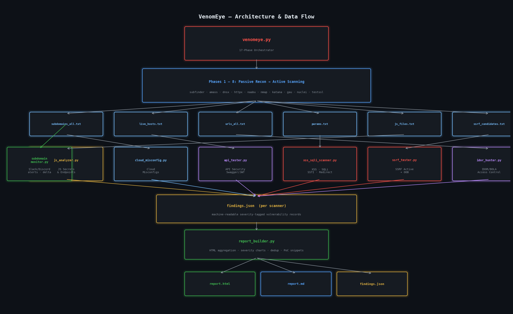
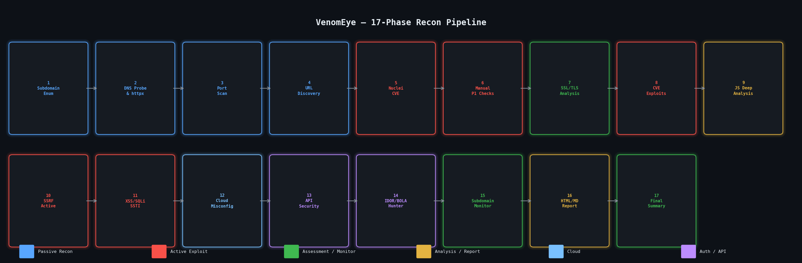
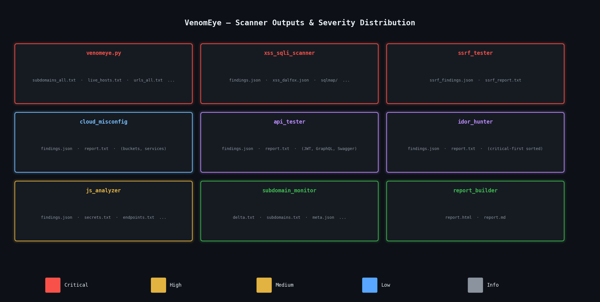

<div align="center">



### **The All-in-One P1 Bug Bounty Reconnaissance & Exploitation Framework**


*Automate the entire bug bounty recon pipeline — from subdomain enumeration to P1-class exploit confirmation — in a single command.*

</div>

---

## Table of Contents

- [Overview](#overview)
- [Legend](#legend)
- [Architecture & Data Flow](#architecture--data-flow)
- [17-Phase Pipeline](#17-phase-pipeline)
- [Installation](#installation)
  - [Python Requirements](#python-requirements)
  - [External Tool Dependencies](#external-tool-dependencies)
- [Quick Start](#quick-start)
- [Full Usage Reference](#full-usage-reference)
  - [venomeye.py — Master Orchestrator](#venomeye--master-orchestrator)
  - [xss_sqli_scanner.py — Injection Scanner](#xss_sqli_scannerpy--injection-scanner)
  - [ssrf_tester.py — SSRF Exploitation](#ssrf_testerpy--ssrf-exploitation)
  - [cloud_misconfig.py — Cloud Misconfiguration](#cloud_misconfigpy--cloud-misconfiguration)
  - [api_tester.py — API Security](#api_testerpy--api-security)
  - [idor_hunter.py — IDOR/BOLA Hunter](#idor_hunterpy--idorbola-hunter)
  - [js_analyzer.py — JS Secret Hunter](#js_analyzerpy--js-secret-hunter)
  - [subdomain_monitor.py — Continuous Monitor](#subdomain_monitorpy--continuous-monitor)
  - [report_builder.py — HTML Report](#report_builderpy--html-report)
  - [generate_report.py — PDF Report](#generate_reportpy--pdf-report)
- [Output Files Reference](#output-files-reference)
- [Workflow Examples](#workflow-examples)
- [Tips for Maximum P1 Yield](#tips-for-maximum-p1-yield)
- [Disclaimer](#disclaimer)

---

## Overview



**VenomEye** is a modular, Python 3 bug bounty toolkit designed for professional pentesters and hunters operating on **Kali Linux**. It orchestrates 17 sequential reconnaissance and exploitation phases, from passive subdomain enumeration all the way through active P1-class vulnerability confirmation.

Every module is a **standalone CLI tool** — run the full 17-phase pipeline with `venomeye.py`, or surgically re-run any single phase independently.

| Feature | Detail |
|---|---|
| **Full recon pipeline** | 17 automated phases, passive → active |
| **Active exploitation** | XSS, SQLi, SSTI, SSRF, IDOR, JWT, CORS |
| **Cloud coverage** | S3, Azure Blob, GCP Storage, Firebase, Elasticsearch, Docker |
| **JS analysis** | 28+ secret patterns, API endpoint extraction |
| **Continuous monitoring** | Subdomain delta with Slack/Discord alerts |
| **Report generation** | HTML, Markdown, PDF outputs |
| **OOB support** | interactsh-client integration for blind SSRF/XSS |
| **Multi-account IDOR** | Dual-cookie cross-account access control testing |

---

## Legend

```
[PHASE]   One of the 17 venomeye phases
[TOOL]    An external binary called by a phase
[FLAG]    A CLI argument / option
[OUT]     An output file produced by a phase or scanner
[INPUT]   A file consumed by a standalone scanner
[CRIT]    Critical severity finding class
[HIGH]    High severity finding class
[MED]     Medium severity finding class
[LOW]     Low / informational finding class
```

| Icon | Meaning |
|------|---------|
| 🔴 | Critical / P1 class vulnerability |
| 🟠 | High severity |
| 🟡 | Medium severity |
| 🔵 | Informational / low |
| 🌐 | Network / DNS phase |
| 🔍 | Enumeration / discovery phase |
| 💣 | Active exploitation phase |
| ☁️  | Cloud misconfiguration |
| 🔐 | Authentication / access control |
| 📄 | Reporting phase |

---

## Architecture & Data Flow

<div align="center">

</div>

### ASCII Reference

```
                        ┌─────────────────────────────────┐
                        │         venomeye.py              │
                        │     (17-Phase Orchestrator)      │
                        └──────────────┬──────────────────┘
                                       │
          ┌────────────────────────────▼────────────────────────────┐
          │                    PHASES 1 – 8                          │
          │         Passive Recon → Active Scanning                   │
          └──────────────────────────────────────────────────────────┘
                 │              │              │              │
        ┌────────▼────┐  ┌─────▼──────┐  ┌───▼──────┐  ┌───▼──────┐
        │ subdomains   │  │ live_hosts │  │ urls_all │  │ js_files │
        │ _all.txt     │  │ .txt       │  │ .txt     │  │ .txt     │
        └────────┬────┘  └─────┬──────┘  └───┬──────┘  └───┬──────┘
                 │             │              │              │
          ┌──────▼──────┬──────▼──────┬───────▼──────┬──────▼──────┐
          │             │             │               │             │
          ▼             ▼             ▼               ▼             ▼
   ┌────────────┐ ┌──────────┐ ┌──────────┐ ┌────────────┐ ┌─────────────┐
   │ subdomain  │ │  cloud   │ │   api    │ │    idor    │ │    js       │
   │ monitor.py │ │ misconfig│ │ tester.py│ │  hunter.py │ │ analyzer.py │
   └─────┬──────┘ └────┬─────┘ └────┬─────┘ └─────┬──────┘ └──────┬──────┘
         │             │            │              │               │
         └─────────────┴────────────┴──────────────┴───────────────┘
                                    │
                             ┌──────▼──────┐
                             │  params.txt │
                             │ssrf_candidat│
                             └──────┬──────┘
                                    │
                    ┌───────────────┴───────────────┐
                    │                               │
             ┌──────▼──────┐               ┌────────▼──────┐
             │ xss_sqli    │               │  ssrf_tester  │
             │ _scanner.py │               │     .py       │
             └──────┬──────┘               └────────┬──────┘
                    │                               │
                    └───────────────┬───────────────┘
                                    │
                             ┌──────▼──────┐
                             │report_build │
                             │   er.py     │
                             └──────┬──────┘
                                    │
                             ┌──────▼──────┐
                             │  report.html│
                             │  report.md  │
                             └─────────────┘
```

### File I/O Map

| Phase Output File | Consumed By |
|---|---|
| `subdomains_all.txt` | DNS probe, monitoring |
| `live_hosts.txt` | Port scan, cloud_misconfig, api_tester |
| `urls_all.txt` | api_tester, idor_hunter |
| `params.txt` | xss_sqli_scanner |
| `ssrf_candidates.txt` | ssrf_tester |
| `js_files.txt` | js_analyzer |
| `exposed_paths.txt` | api_tester |
| `*/findings.json` | report_builder |

---

## 17-Phase Pipeline

<div align="center">

</div>

| # | Phase | Category | Tools | Key Output |
|---|-------|----------|-------|------------|
| 1 | 🌐 Subdomain Enumeration | Passive Recon | subfinder, amass, assetfinder, crt.sh | `subdomains_all.txt` |
| 2 | 🌐 DNS Probe & HTTP Detection | Active Recon | dnsx, httpx | `live_hosts.txt`, `httpx_full.json` |
| 3 | 🌐 Port & Service Scanning | Active Recon | naabu, nmap | `nmap_services.xml`, `nmap_http_ports.txt` |
| 4 | 🔍 URL & Endpoint Discovery | Recon | katana, gau, waybackurls, hakrawler | `urls_all.txt`, `params.txt` |
| 5 | 🔴 Nuclei CVE Scanning | Vulnerability | nuclei | `nuclei_crit.txt`, `nuclei_high.txt` |
| 6 | 🔍 Manual P1 Checks | Active | curl | `cors_issues.txt`, `ssrf_candidates.txt`, `takeover_candidates.txt` |
| 7 | 🔵 SSL/TLS Analysis | Assessment | testssl.sh | `ssl_results.txt`, `cert_info.txt` |
| 8 | 🔴 CVE-Specific Exploits | Active | nmap NSE | `nmap_log4shell.txt`, `nmap_heartbleed.txt` |
| 9 | 🔍 JS Deep Analysis | Active | js_analyzer.py | `js_analysis/secrets.txt`, `endpoints.txt` |
| 10 | 🔴 SSRF Active Testing | Exploitation | ssrf_tester.py | `ssrf_results/ssrf_findings.json` |
| 11 | 🔴 XSS / SQLi / SSTI | Exploitation | xss_sqli_scanner.py, dalfox, sqlmap | `param_scan/findings.json` |
| 12 | ☁️ Cloud Misconfiguration | Assessment | cloud_misconfig.py | `cloud_results/findings.json` |
| 13 | 🔐 API Security Testing | Exploitation | api_tester.py | `api_results/findings.json` |
| 14 | 🔐 IDOR / BOLA Hunting | Exploitation | idor_hunter.py | `idor_results/findings.json` |
| 15 | 🌐 Subdomain Monitor | Monitoring | subdomain_monitor.py | `monitor/delta.txt` |
| 16 | 📄 HTML/MD Report | Reporting | report_builder.py | `report.html`, `report.md` |
| 17 | 📄 Summary Output | Reporting | — | `final_report.txt` |

---

## Installation

### Python Requirements

```bash
# Python 3.9+ required
python3 --version

# Clone the repository
git clone https://github.com/yourhandle/venomeye.git
cd venomeye

# No pip dependencies — pure Python standard library
# Optional: for PDF report generation
pip3 install weasyprint
```

### External Tool Dependencies

All tools must be available on `$PATH`. Install on Kali Linux:

```bash
# Go-based tools (recommended: use latest release binaries)
go install -v github.com/projectdiscovery/subfinder/v2/cmd/subfinder@latest
go install -v github.com/projectdiscovery/dnsx/cmd/dnsx@latest
go install -v github.com/projectdiscovery/httpx/cmd/httpx@latest
go install -v github.com/projectdiscovery/naabu/v2/cmd/naabu@latest
go install -v github.com/projectdiscovery/katana/cmd/katana@latest
go install -v github.com/projectdiscovery/nuclei/v3/cmd/nuclei@latest
go install -v github.com/projectdiscovery/interactsh/cmd/interactsh-client@latest
go install -v github.com/hahwul/dalfox/v2@latest
go install -v github.com/tomnomnom/assetfinder@latest
go install -v github.com/tomnomnom/waybackurls@latest
go install -v github.com/hakluke/hakrawler@latest
go install -v github.com/lc/gau/v2/cmd/gau@latest

# Amass
go install -v github.com/owasp-amass/amass/v4/...@master

# Nmap (system package)
sudo apt install -y nmap

# sqlmap (system package)
sudo apt install -y sqlmap

# testssl.sh
git clone --depth 1 https://github.com/drwetter/testssl.sh.git /opt/testssl
ln -s /opt/testssl/testssl.sh /usr/local/bin/testssl.sh

# js-beautify (optional, for js_analyzer.py)
npm install -g js-beautify

# Update nuclei templates
nuclei -update-templates
```

**Dependency checklist table:**

| Tool | Purpose | Source |
|------|---------|--------|
| `subfinder` | Passive subdomain enum | projectdiscovery/subfinder |
| `amass` | Advanced subdomain enum | owasp-amass/amass |
| `assetfinder` | Asset discovery | tomnomnom/assetfinder |
| `dnsx` | DNS resolution | projectdiscovery/dnsx |
| `httpx` | HTTP probing | projectdiscovery/httpx |
| `naabu` | Port scanning | projectdiscovery/naabu |
| `nmap` | Service + NSE vuln scan | nmap.org |
| `katana` | Web crawling | projectdiscovery/katana |
| `gau` | Wayback URL fetching | lc/gau |
| `waybackurls` | Wayback Machine integration | tomnomnom/waybackurls |
| `hakrawler` | Endpoint crawler | hakluke/hakrawler |
| `nuclei` | CVE template scanner | projectdiscovery/nuclei |
| `testssl.sh` | SSL/TLS assessment | drwetter/testssl.sh |
| `dalfox` | XSS detection | hahwul/dalfox |
| `sqlmap` | SQLi detection & exploit | sqlmapproject/sqlmap |
| `interactsh-client` | OOB callback detection | projectdiscovery/interactsh |
| `js-beautify` | JS formatting (optional) | beautify/js-beautify |

---

## Quick Start

```bash
# Full 17-phase recon on a single target
python3 venomeye.py -d target.com -o ./output/

# Fast mode — skip amass, critical/high nuclei only
python3 venomeye.py -d target.com -o ./output/ --fast

# Authenticated full scan with dual cookies (for IDOR testing)
python3 venomeye.py -d target.com -o ./output/ \
  --cookie "session=abc123" \
  --cookie2 "session=xyz789"

# Full scan + OOB SSRF detection + Slack alerts
python3 venomeye.py -d target.com -o ./output/ \
  --interactsh \
  --slack-webhook "https://hooks.slack.com/services/..."

# Verbose mode — see every command as it runs
python3 venomeye.py -d target.com -o ./output/ --verbose
```

---

## Full Usage Reference

### venomeye — Master Orchestrator

```
python3 venomeye.py [OPTIONS]
```

**Required:**

| Flag | Description |
|------|-------------|
| `-d, --domain TARGET` | Target domain (e.g. `example.com`) |

**Output:**

| Flag | Default | Description |
|------|---------|-------------|
| `-o, --output DIR` | auto-generated | Output directory for all phase results |

**Scan Control:**

| Flag | Description |
|------|-------------|
| `--fast` | Fast mode — skip amass, report only critical/high findings |
| `--full-ports` | Scan all 65535 ports (default: top 1000) |
| `--nuclei-only` | Re-run nuclei on existing `live_hosts.txt`, skip earlier phases |
| `--verbose` | Print every shell command as it executes |

**Authentication:**

| Flag | Description |
|------|-------------|
| `--cookie "VALUE"` | Session cookie for account A (used in all authenticated phases) |
| `--cookie2 "VALUE"` | Session cookie for account B (used in IDOR cross-account testing) |

**SSRF / OOB:**

| Flag | Description |
|------|-------------|
| `--oob HOST` | OOB callback host for blind SSRF (e.g. `abc123.oast.fun`) |
| `--interactsh` | Auto-start `interactsh-client` and use its host for SSRF OOB |

**SQLi Tuning:**

| Flag | Default | Description |
|------|---------|-------------|
| `--sqli-level N` | 1 | sqlmap level (1–5). Higher = more payloads |
| `--sqli-risk N` | 1 | sqlmap risk (1–3). Higher = more dangerous payloads |

**Notifications:**

| Flag | Description |
|------|-------------|
| `--slack-webhook URL` | Slack incoming webhook URL for real-time alerts |
| `--discord-webhook URL` | Discord webhook URL for real-time alerts |

**Phase Skip Flags** *(selectively disable phases)*:

| Flag | Skips Phase |
|------|------------|
| `--skip-ports` | Phase 3 — port scanning |
| `--skip-ssl` | Phase 7 — SSL/TLS analysis |
| `--skip-urls` | Phase 4 — URL/endpoint discovery |
| `--skip-js` | Phase 9 — JS deep analyzer |
| `--skip-ssrf` | Phase 10 — SSRF active testing |
| `--skip-params` | Phase 11 — XSS/SQLi/SSTI scanning |
| `--skip-cloud` | Phase 12 — cloud misconfiguration |
| `--skip-api` | Phase 13 — API security testing |
| `--skip-idor` | Phase 14 — IDOR/BOLA hunting |
| `--skip-monitor` | Phase 15 — subdomain monitoring |

---

### xss_sqli_scanner.py — Injection Scanner

Tests parameterized URLs for XSS, SQL injection, SSTI, and open redirect vulnerabilities.

```
python3 xss_sqli_scanner.py -i ./output/params.txt -o ./param_scan/ [OPTIONS]
```

**Input/Output:**

| Flag | Default | Description |
|------|---------|-------------|
| `-i, --input FILE` | required | `params.txt` — one parameterized URL per line |
| `-o, --output DIR` | `./param_scan` | Output directory |

**Authentication:**

| Flag | Description |
|------|-------------|
| `--cookie "VALUE"` | Cookie header for authenticated scanning |

**Scan Options:**

| Flag | Default | Description |
|------|---------|-------------|
| `-t, --threads N` | 20 | Concurrent threads for SSTI/redirect checks |
| `--sqli-level N` | 1 | sqlmap level (1–5) |
| `--sqli-risk N` | 1 | sqlmap risk (1–3) |
| `--limit N` | 0 (all) | Maximum URLs to test per scanner |
| `--redirect-file FILE` | — | Separate file of open redirect candidates |

**Skip Flags:**

| Flag | Skips |
|------|-------|
| `--skip-xss` | XSS scanning via dalfox |
| `--skip-sqli` | SQL injection via sqlmap |
| `--skip-ssti` | SSTI payload probing |
| `--skip-redirect` | Open redirect confirmation |

**SSTI Engines Tested:** Jinja2, FreeMarker, Thymeleaf, ERB, Smarty, Spring SpEL

**Output files:** `findings.json`, `xss_dalfox.json`, `sqlmap/`, `report.txt`

---

### ssrf_tester.py — SSRF Exploitation

Active SSRF testing with cloud metadata endpoint probing, internal service detection, and OOB callback.

```
python3 ssrf_tester.py -i ./output/ssrf_candidates.txt -o ./ssrf_results/ [OPTIONS]
```

**Input/Output:**

| Flag | Default | Description |
|------|---------|-------------|
| `-i, --input FILE` | required | `ssrf_candidates.txt` from venomeye phase 6 |
| `-o, --output DIR` | `./ssrf_results` | Output directory |

**OOB Options:**

| Flag | Description |
|------|-------------|
| `--oob HOST` | OOB callback hostname (e.g. `token.oast.fun`) |
| `--interactsh` | Auto-start `interactsh-client` for OOB detection |

**Tuning:**

| Flag | Default | Description |
|------|---------|-------------|
| `-t, --threads N` | 10 | Concurrent threads |
| `--timeout N` | 10 | Per-request timeout in seconds |
| `--limit N` | 0 (all) | Max URLs to test |

**Cloud Metadata Targets Probed:**
- AWS IMDSv1: `http://169.254.169.254/latest/meta-data/`
- AWS IMDSv2: with `X-aws-ec2-metadata-token` header
- GCP: `http://metadata.google.internal/computeMetadata/v1/`
- Azure: `http://169.254.169.254/metadata/instance`
- DigitalOcean, Oracle Cloud, Alibaba Cloud, Kubernetes

**Internal Services Probed:** Redis, Elasticsearch, MongoDB, Consul, Docker daemon, ngrok

**Output files:** `ssrf_findings.json`, `ssrf_report.txt`

---

### cloud_misconfig.py — Cloud Misconfiguration

Checks for publicly accessible cloud buckets and exposed internal services.

```
python3 cloud_misconfig.py -d target.com -o ./cloud_results/ [OPTIONS]
```

**Input:**

| Flag | Description |
|------|-------------|
| `-d, --domain DOMAIN` | Target domain for bucket name permutations |
| `-b, --buckets FILE` | File with explicit bucket names (one per line) |
| `-l, --live-hosts FILE` | `live_hosts.txt` for service exposure checks |

**Output:**

| Flag | Default | Description |
|------|---------|-------------|
| `-o, --output DIR` | `./cloud_results` | Output directory |

**Tuning:**

| Flag | Default | Description |
|------|---------|-------------|
| `-t, --threads N` | 30 | Concurrent threads |

**Skip Flags:**

| Flag | Skips |
|------|-------|
| `--skip-s3` | AWS S3 bucket checks |
| `--skip-azure` | Azure Blob Storage checks |
| `--skip-gcp` | GCP Storage bucket checks |
| `--skip-firebase` | Firebase Realtime DB checks |
| `--skip-services` | Exposed service detection |

**Cloud Platforms:** S3, Azure Blob, GCP Storage, Firebase

**Exposed Services Detected:** Elasticsearch, Kibana, etcd, Consul, Docker daemon, Prometheus, Spring Actuator, Apache Tomcat Manager

**Output files:** `findings.json`, `report.txt`

---

### api_tester.py — API Security

Discovers and exploits API misconfigurations including unauthenticated endpoints, GraphQL, JWT, and mass assignment.

```
python3 api_tester.py -u ./output/urls_all.txt -l ./output/live_hosts.txt -o ./api_results/ [OPTIONS]
```

**Input:**

| Flag | Description |
|------|-------------|
| `-u, --urls FILE` | `urls_all.txt` from venomeye phase 4 |
| `-l, --live-hosts FILE` | `live_hosts.txt` from venomeye phase 2 |

**Output:**

| Flag | Default | Description |
|------|---------|-------------|
| `-o, --output DIR` | `./api_results` | Output directory |

**Authentication:**

| Flag | Description |
|------|-------------|
| `--cookie "VALUE"` | Session cookie for auth context |
| `--jwt TOKEN` | JWT token string to test for vulnerabilities |
| `--jwt-url URL` | Endpoint to replay JWT attacks against |

**Tuning:**

| Flag | Default | Description |
|------|---------|-------------|
| `-t, --threads N` | 15 | Concurrent threads |

**Skip Flags:**

| Flag | Skips |
|------|-------|
| `--skip-graphql` | GraphQL introspection testing |
| `--skip-swagger` | Swagger/OpenAPI discovery |
| `--skip-jwt` | JWT vulnerability attacks |

**Vulnerability Classes:**
- Swagger/OpenAPI endpoint exposure (unauthenticated access)
- GraphQL introspection + field suggestion enumeration
- JWT `alg:none` bypass, weak secret cracking
- Mass assignment field injection

**Output files:** `findings.json`, `report.txt`

---

### idor_hunter.py — IDOR/BOLA Hunter

Identifies object ID patterns in URLs and tests horizontal/vertical access control across accounts.

```
python3 idor_hunter.py -i ./output/urls_all.txt -o ./idor_results/ [OPTIONS]
```

**Input/Output:**

| Flag | Default | Description |
|------|---------|-------------|
| `-i, --input FILE` | required | `urls_all.txt` from venomeye |
| `-o, --output DIR` | `./idor_results` | Output directory |

**Authentication:**

| Flag | Description |
|------|-------------|
| `--cookie "VALUE"` | Session cookie for account A |
| `--cookie2 "VALUE"` | Session cookie for account B (cross-account IDOR) |
| `--cookies-file FILE` | File with one cookie per line (multi-account testing) |

**Tuning:**

| Flag | Default | Description |
|------|---------|-------------|
| `-t, --threads N` | 10 | Concurrent threads |
| `--timeout N` | 10 | Per-request timeout in seconds |
| `--limit N` | 500 | Maximum URLs to test |

**Access Control Tests:**

| Flag | Description |
|------|-------------|
| `--check-unauth` | Also test for completely unauthenticated access |

**ID Pattern Detection:**
- Numeric IDs in path segments (`/users/123`) and query params (`?id=123`)
- UUID v4 patterns
- Hash-like IDs (MD5, SHA1, SHA256)

**ID Substitution Variants Tested:** `id+1`, `id-1`, `id=0`, `id=1`, `id=2`, `id=9999999`

**Output files:** `findings.json`, `report.txt` (sorted critical-first)

---

### js_analyzer.py — JS Secret Hunter

Fetches and deep-analyzes JavaScript files for secrets, internal API endpoints, and cloud references.

```
python3 js_analyzer.py -i ./output/js_files.txt -o ./js_analysis/ [OPTIONS]
```

**Input/Output:**

| Flag | Default | Description |
|------|---------|-------------|
| `-i, --input FILE` | required | `js_files.txt` — one JS URL per line |
| `-o, --output DIR` | `./js_analysis` | Output directory |
| `-d, --domain DOMAIN` | — | Base domain for contextual filtering |

**Tuning:**

| Flag | Default | Description |
|------|---------|-------------|
| `-t, --threads N` | 20 | Concurrent fetcher threads |
| `--limit N` | 0 (all) | Max JS files to process |
| `--no-beautify` | — | Skip `js-beautify` formatting step |

**Secret Patterns Detected (28+):**

| Category | Examples |
|----------|---------|
| AWS | Access Key ID, Secret Access Key, Session Token |
| Auth Tokens | GitHub tokens, Google OAuth, Facebook tokens |
| Payment | Stripe publishable/secret keys, PayPal |
| Crypto | Private keys (RSA, EC, PEM), SSH keys |
| Database | PostgreSQL, MySQL, MongoDB connection strings |
| Infrastructure | Twilio SID/token, SendGrid API, Mailgun |
| Generic | `password=`, `api_key=`, `secret=`, `token=` patterns |

**Also extracts:**
- API endpoints (from `fetch()`, `axios`, `XMLHttpRequest`, hardcoded paths)
- Internal IP addresses (RFC 1918 ranges + localhost)
- Cloud storage references (S3 bucket URLs, Azure Blob, GCP, CloudFront, Lambda ARNs)

**Output files:** `findings.json`, `secrets.txt`, `endpoints.txt`, `internals.txt`

---

### subdomain_monitor.py — Continuous Monitor

Runs subdomain enumeration on a schedule and alerts on newly discovered or disappeared assets.

```
python3 subdomain_monitor.py -d target.com [OPTIONS]
```

**Input:**

| Flag | Description |
|------|-------------|
| `-d, --domain DOMAIN` | required — Target domain to monitor |
| `--diff DIR` | Manually specify a previous scan directory to diff against |

**Output:**

| Flag | Default | Description |
|------|---------|-------------|
| `-o, --output DIR` | `./monitor/<domain>` | Output base directory |

**Monitoring:**

| Flag | Default | Description |
|------|---------|-------------|
| `--watch N` | 0 (run once) | Repeat scan every N seconds (0 = single run) |

**Alerts:**

| Flag | Description |
|------|-------------|
| `--slack-webhook URL` | Slack incoming webhook for delta alerts |
| `--discord-webhook URL` | Discord webhook for delta alerts |

**Delta Tracking:**
- New subdomains discovered since last scan
- Subdomains that disappeared (possible takeover indicators)
- New live HTTP hosts
- New open ports

**Output files per scan:** `subdomains.txt`, `live_hosts.txt`, `ports.txt`, `meta.json`, `delta.txt`, alert payloads

---

### report_builder.py — HTML Report

Aggregates all scanner JSON findings into a single polished, interactive HTML report.

```
python3 report_builder.py -i ./output/ -o ./final_report.html [OPTIONS]
```

**Input/Output:**

| Flag | Default | Description |
|------|---------|-------------|
| `-i, --input DIR` | required | venomeye output directory (contains all scanner subdirs) |
| `-o, --output FILE` | `./report.html` | Output HTML file path |

**Customization:**

| Flag | Description |
|------|-------------|
| `--css FILE` | Path to custom CSS file for report styling |
| `--title TEXT` | Custom report title string |

**Report Features:**
- Severity-based grouping (Critical → High → Medium → Low → Info)
- Interactive sortable findings table (JavaScript-enabled)
- Severity distribution pie chart
- Finding deduplication by URL + vulnerability type
- Copy-paste PoC snippets per finding
- Standalone single-file HTML (no external dependencies)

**Sources aggregated:** nuclei, xss_sqli_scanner, ssrf_tester, cloud_misconfig, api_tester, idor_hunter, js_analyzer

---

### generate_report.py — PDF Report

Generates a professional PDF threat-hunting report from `threat_hunting.csv`.

```
python3 generate_report.py
```

Reads `threat_hunting.csv` from the current directory and produces a timestamped PDF report using `weasyprint`. No CLI flags — edit the source CSV to control content.

**Requires:** `pip3 install weasyprint`

---

## Output Files Reference

<div align="center">

</div>

```
output/
├── subdomains_all.txt          # Merged unique subdomains
├── resolved.txt                # DNS-resolved hosts with IPs
├── live_hosts.txt              # HTTP-responsive hosts
├── httpx_full.json             # Full httpx response data
├── urls_all.txt                # All discovered URLs
├── params.txt                  # Parameterized URLs (for injection)
├── js_files.txt                # JavaScript file URLs
├── nmap_services.xml           # Nmap service scan results
├── nuclei_crit.txt             # Critical nuclei findings
├── nuclei_high.txt             # High nuclei findings
├── manual_checks/
│   ├── ssrf_candidates.txt     # SSRF test candidates
│   ├── open_redirect_candidates.txt
│   ├── cors_issues.txt         # CORS misconfigurations
│   ├── exposed_paths.txt       # Sensitive exposed paths
│   └── takeover_candidates.txt # Subdomain takeover targets
├── cve_checks/
│   ├── nuclei_cve.json
│   ├── nmap_http-log4shell.txt
│   └── nmap_ssl-heartbleed.txt
├── js_analysis/
│   ├── findings.json
│   ├── secrets.txt
│   ├── endpoints.txt
│   └── internals.txt
├── ssrf_results/
│   ├── ssrf_findings.json
│   └── ssrf_report.txt
├── param_scan/
│   ├── findings.json
│   ├── xss_dalfox.json
│   ├── sqlmap/
│   └── report.txt
├── cloud_results/
│   ├── findings.json
│   └── report.txt
├── api_results/
│   ├── findings.json
│   └── report.txt
├── idor_results/
│   ├── findings.json
│   └── report.txt
├── monitor/
│   └── <timestamp>/
│       ├── subdomains.txt
│       ├── live_hosts.txt
│       ├── delta.txt
│       └── meta.json
├── report.html                 # Final interactive HTML report
└── report.md                   # Markdown findings summary
```

---

## Workflow Examples

### Example 1: Complete P1 Hunt from Scratch

```bash
# Step 1: Full recon with all phases
python3 venomeye.py -d target.com -o ./target_recon/ --verbose

# Step 2: Re-run individual phases with more depth
python3 xss_sqli_scanner.py \
  -i ./target_recon/params.txt \
  -o ./target_recon/param_scan/ \
  --sqli-level 3 --sqli-risk 2 \
  --cookie "session=abc123"

# Step 3: Re-generate final report
python3 report_builder.py \
  -i ./target_recon/ \
  -o ./target_final_report.html \
  --title "Target.com Bug Bounty Report"
```

### Example 2: Authenticated Scan with IDOR Focus

```bash
python3 venomeye.py -d app.target.com -o ./auth_scan/ \
  --cookie "session=ACCOUNT_A_TOKEN" \
  --cookie2 "session=ACCOUNT_B_TOKEN" \
  --skip-ssl --skip-ports \
  --verbose
```

### Example 3: Quick Cloud & API Sweep

```bash
# Cloud buckets only
python3 cloud_misconfig.py \
  -d target.com \
  -l ./recon/live_hosts.txt \
  -o ./cloud_out/

# API testing only
python3 api_tester.py \
  -u ./recon/urls_all.txt \
  -l ./recon/live_hosts.txt \
  -o ./api_out/ \
  --cookie "session=TOKEN"
```

### Example 4: Continuous Monitoring with Alerts

```bash
# Monitor every hour with Slack alerts
python3 subdomain_monitor.py \
  -d target.com \
  --watch 3600 \
  --slack-webhook "https://hooks.slack.com/services/XXX/YYY/ZZZ"
```

### Example 5: Blind SSRF with OOB

```bash
# Start interactsh in another terminal, or use --interactsh
python3 ssrf_tester.py \
  -i ./recon/ssrf_candidates.txt \
  -o ./ssrf_out/ \
  --interactsh \
  --threads 20
```

### Example 6: JS Secret Hunting

```bash
python3 js_analyzer.py \
  -i ./recon/js_files.txt \
  -o ./js_secrets/ \
  -d target.com \
  --threads 30
```

---

## Tips for Maximum P1 Yield

1. **Always use `--cookie` for authenticated scans.** The IDOR and API modules perform significantly better with a valid session token — they can confirm access control bypasses with a real differential response.

2. **Pair `--cookie` with `--cookie2` for IDOR.** Two accounts from the same target application gives the cross-account differential needed to confirm horizontal privilege escalation.

3. **Use `--interactsh` for blind SSRF.** AWS metadata endpoints are protected by IMDSv2 and won't reflect in responses. OOB DNS callbacks are the only reliable way to confirm blind SSRF.

4. **Run `--sqli-level 3 --sqli-risk 2` for deeper SQLi.** Default level 1/risk 1 only catches obvious injections. Increase both for WAF-bypassing payloads.

5. **Use `--fast` on large scopes.** Amass can take hours on large targets. `--fast` skips it and filters nuclei to critical/high only, cutting total time from hours to 30-40 minutes.

6. **Run `subdomain_monitor.py --watch 3600` passively.** New assets appear constantly during bug bounty programs. Fresh subdomains are often misconfigured. Set and forget — the delta file shows exactly what changed.

7. **Check `js_analysis/secrets.txt` first.** JS hardcoded secrets often yield direct AWS console access, internal API access, or Stripe/Twilio API key abuse — all immediate P1 findings.

8. **Re-run `report_builder.py` after any manual additions.** The HTML report reads from JSON — add manual findings to any `findings.json` file and the report will include them automatically.

---

## Disclaimer

> **VenomEye is intended for authorized security testing only.**
>
> Use this toolkit only against systems you own or have explicit written permission to test. Unauthorized access to computer systems is illegal under the Computer Fraud and Abuse Act (CFAA), the Computer Misuse Act, and equivalent laws worldwide.
>
> The authors assume no liability for misuse of this software. Always obtain proper authorization before running any scanner against a target.
>
> This tool is designed for professional bug bounty hunters operating within the scope defined by the bug bounty program's rules of engagement.

---

<div align="center">

**VenomEye** — Built for hunters, by hunters.

*If this toolkit helped you find a P1, drop a ⭐ and share the love.*

</div>
